<div align="center">

# 🚀 FreelanceHub
### *Decentralized Web3 Marketplace*


<br/>


**A decentralized freelance marketplace built on Ethereum blockchain**

*Connecting freelancers and clients in a trustless, transparent environment*

---

<!-- 🌐 **[Live Demo](https://freelancehub-demo.com)** • 📖 **[Documentation](https://docs.freelancehub.com)** • 🐛 **[Report Bug](https://github.com/freelancehub/issues)** -->

</div>

## ✨ Features

<div align="center">

| 🔐 **Blockchain Powered** | 💰 **Secure Payments** | 🎯 **Smart Contracts** | 🌟 **Rating System** |
|:-------------------------:|:----------------------:|:----------------------:|:--------------------:|
| Built on Ethereum | Escrow functionality | Automated workflows | Transparent reviews |

</div>

### 🎯 Core Features

- **🔗 Blockchain Integration**: Ethereum-based smart contracts for secure transactions
- **💼 Job Management**: Post, browse, and manage freelance jobs
- **⭐ Rating & Reviews**: Transparent feedback system for both clients and freelancers
- **💰 Escrow System**: Secure payment holding until job completion
- **📊 Analytics Dashboard**: Track earnings, jobs, and performance metrics
- **🔍 Portfolio Search**: Discover freelancers by their Ethereum address
- **🎨 Modern UI/UX**: Beautiful, responsive design with dark theme

## 🛠️ Tech Stack

<div align="center">

### Frontend
[](https://reactjs.org/)
[](https://www.typescriptlang.org/)
[](https://tailwindcss.com/)
[](https://vitejs.dev/)

### Blockchain
[](https://ethereum.org/)
[](https://soliditylang.org/)
[](https://ethers.org/)
[](https://hardhat.org/)

### Tools & Libraries
[](https://lucide.dev/)
[](https://reactrouter.com/)

</div>

## 📸 Screenshots

<div align="center">

### Dashboard Overview
*Track your earnings, active jobs, and performance metrics*

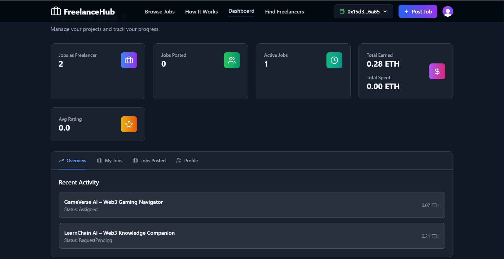

### Find Freelancers
*Search for freelancers by their Ethereum address*

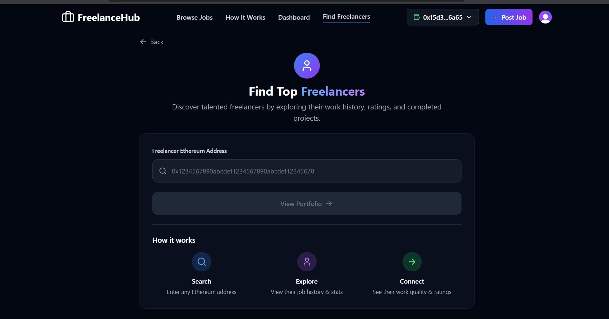

### Freelancer Portfolio
*View freelancer profiles, ratings, and work history*

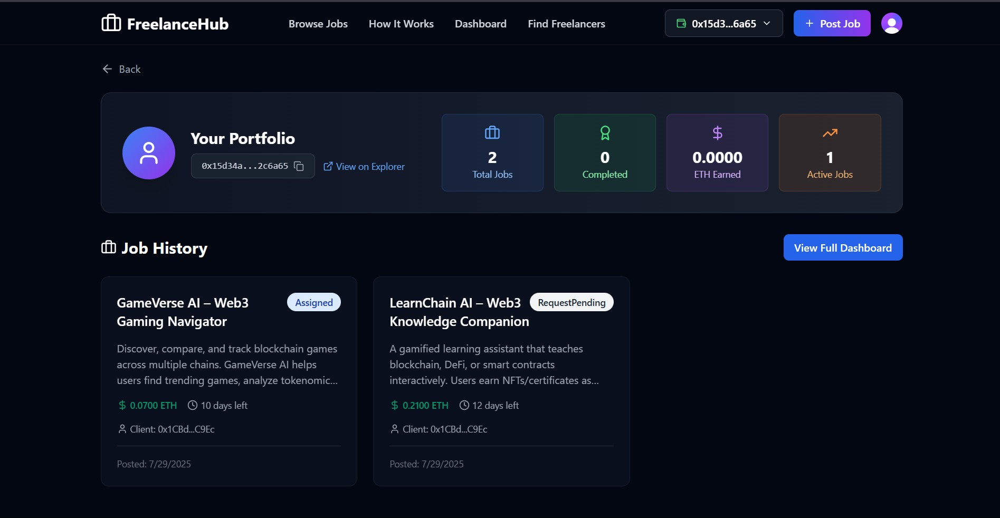

### Job Marketplace
*Browse and post freelance opportunities*

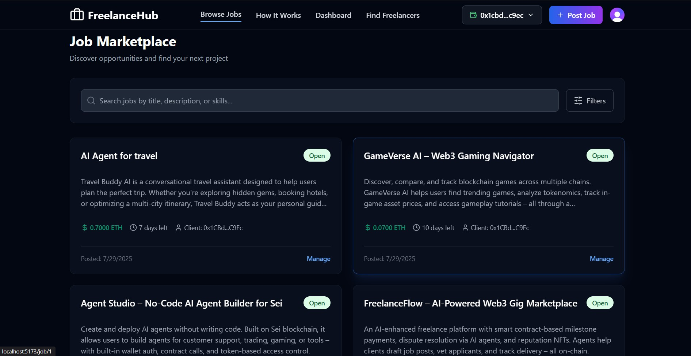

### Job Detail
*View job details, apply, and manage proposals*

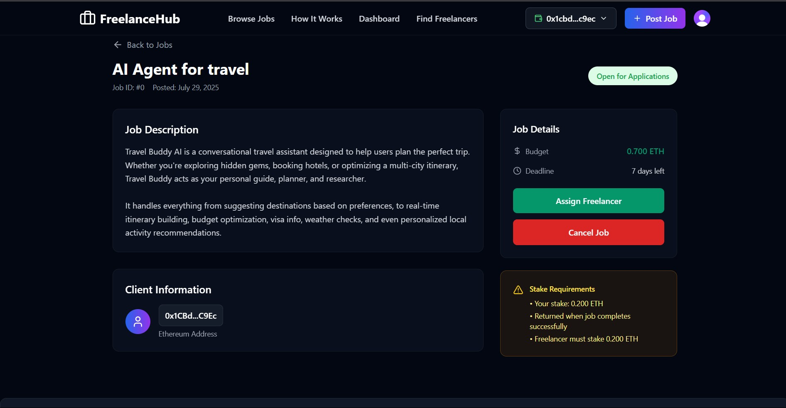

### Freelancer Apply
*Submit your application and confirm your interest*

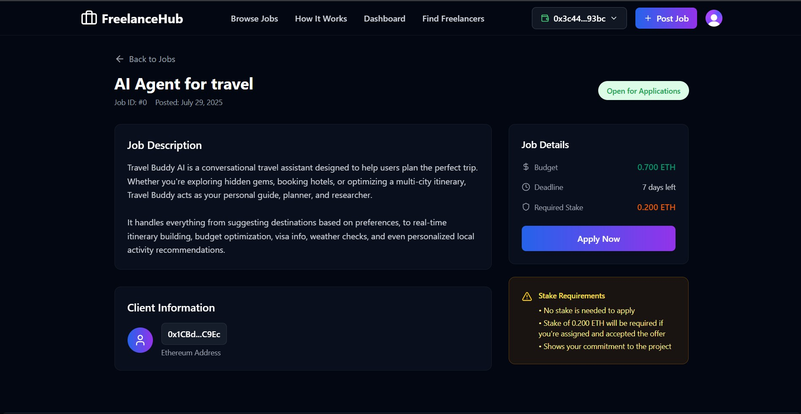

### Freelancer Portfolio
*Showcase your work and build reputation*


### Post Job
*Create new job listings with clear requirements*

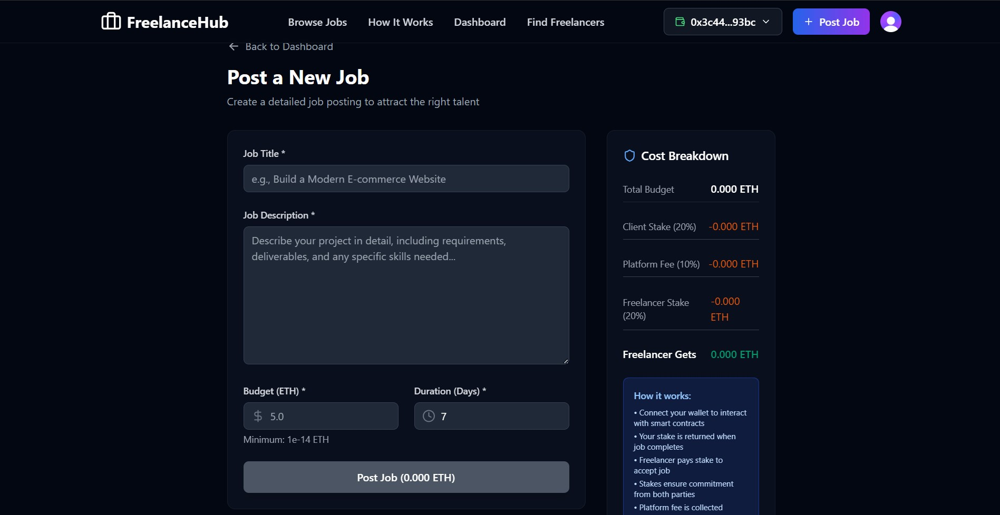

### Freelancer Applications
*Review freelancer applications and proposals*

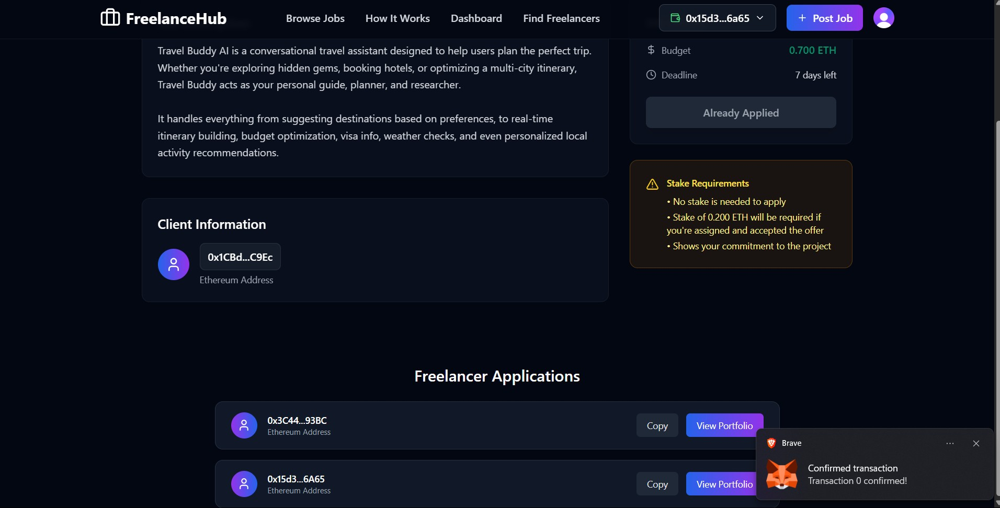

### Assign Freelancer
*Assign a freelancer to a job from their application*

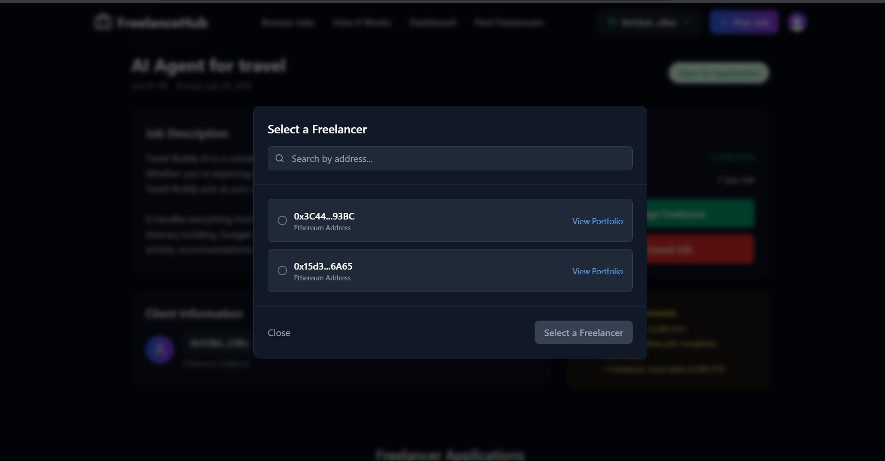

### Accept Offer
*Accept proposal*

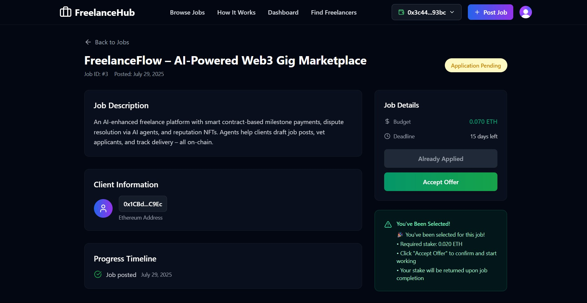

### Submit Proof Of Completion
*Submit proof of work completion for job submission review*

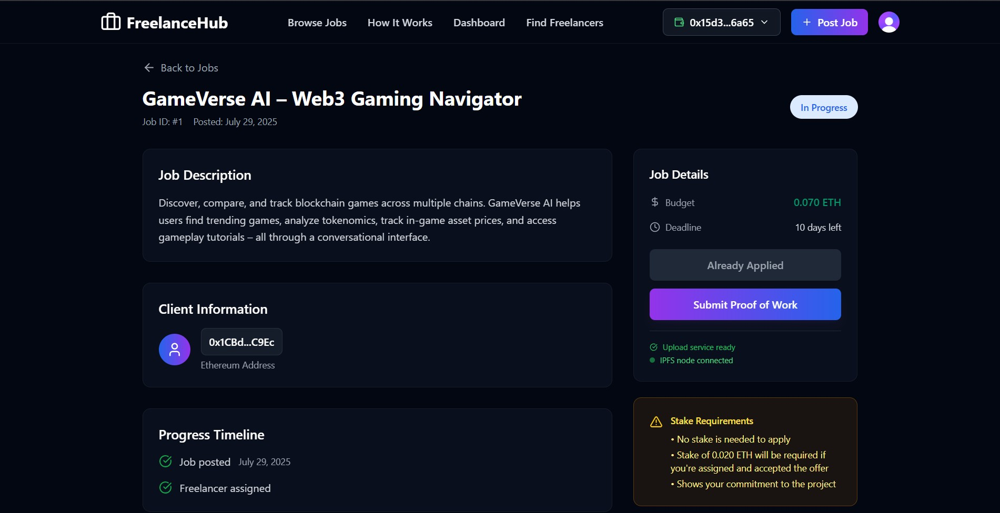

### Upload Proof Of Completion to IPFS
*Upload proof of work to IPFS for secure storage*


### Hash we got to IPFS submission
*View the IPFS hash of the submitted proof of completion*

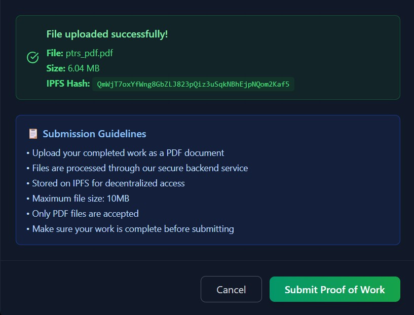

### Progress Timeline and Submission
*Track job progress and submission status*

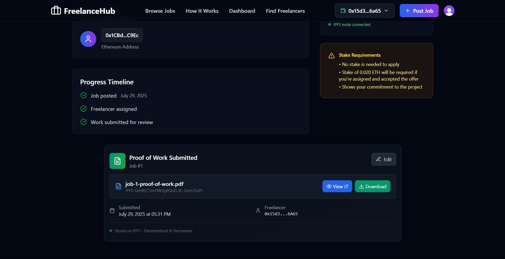

### Rate Freelancer
*Rate the freelancer based on their performance*

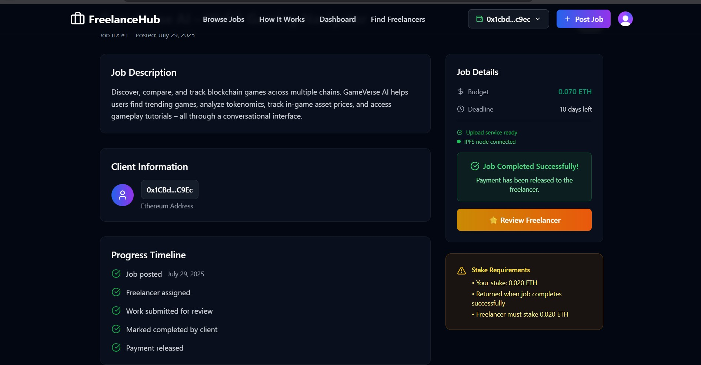   

### See Reviews
*View freelancer reviews and feedback*

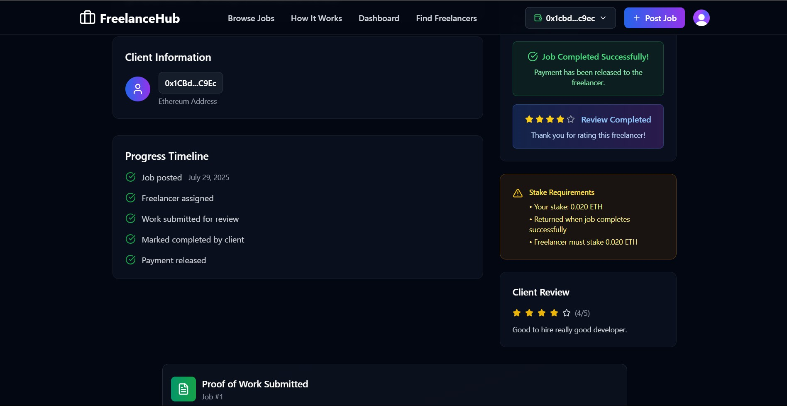

</div>


## 🚀 Quick Start

### Prerequisites

Before you begin, ensure you have the following installed:

- **Node.js** (v18.0.0 or later) - [Download](https://nodejs.org/)
- **npm** or **vite** - Package manager
- **Git** - Version control
- **MetaMask** - Browser wallet extension

### 📦 Installation

1. **Clone the repository**
   ```bash
   git clone https://github.com/your-username/freelance-marketplace.git
   cd freelance-marketplace
   ```

2. **Install dependencies**
   ```bash
   # Install frontend dependencies
   cd frontend
   npm install
   
   # Install blockchain dependencies
   cd ../backend
   npm install
   ```

3. **Environment Setup**
   # Frontend environment
   ```bash
   cd frontend
   cp .env.example .env.local
   ```
   
   Edit `.env.local`:
   ```env
    VITE_CLERK_PUBLISHABLE_KEY=
    VITE_LOCAL_IPFS_GATEWAY=http://localhost:8080/ipfs
    VITE_PUBLIC_IPFS_GATEWAY=https://ipfs.io/ipfs
    VITE_IPFS_API_URL=http://localhost:5001/api/v0
   ```

    # Blockchain environment
    ```bash
        cd backend
        cp .env.example .env
    ```
    ```bash
        PUBLIC_KEY=
        PRIVATE_KEY=
        RPC_URL=
        CHAIN_ID=
        CONTRACT_ADDRESS=
        OWNER=
    ```
4. **Deploy Smart Contracts (Local)**
   ```bash
   cd blockchain
   
   # Start local blockchain
   npx hardhat node
   
   # Deploy contracts (new terminal)
   npx hardhat run scripts/deploy.js --network localhost
   ```
5. **Setting up the IPFS** 
    *Using docker easy to setup and use*
    ```bash
    docker run -d --name ipfs_host -v $ipfs_staging:/export -v $ipfs_data:/data/ipfs -p 4001:4001 -p 4001:4001/udp -p 127.0.0.1:8080:8080 -p 127.0.0.1:5001:5001 ipfs/kubo:master-latest
    ```
5. **Start the application**
   ```bash
   cd frontend
   npm run dev
   ```

6. **Open your browser**
   
   Navigate to `http://localhost:5173`

## 🎮 Usage Guide

### For Freelancers 👨‍💻

1. **🔗 Connect Wallet**: Connect your MetaMask wallet
2. **🔍 Browse Jobs**: Explore available opportunities in the marketplace
3. **📝 Apply for Jobs**: Submit proposals with your rates and timeline
4. **✅ Complete Work**: Deliver quality work and get paid automatically
5. **⭐ Build Portfolio**: Accumulate ratings and build your reputation

### For Clients 👔

1. **📄 Post Jobs**: Create detailed job listings with clear requirements
2. **👀 Review Proposals**: Evaluate freelancer applications
3. **🤝 Hire Freelancers**: Select the best candidate for your project
4. **💰 Release Payment**: Approve work and release escrowed funds
5. **📝 Leave Reviews**: Rate freelancers based on their performance


### Core Contracts

```solidity
📁 contracts/
├── 📄 Marketplace.sol    # Main contract handling job lifecycle
```

<div align="center">

| Metric | Description | Icon |
|--------|-------------|------|
| **Jobs as Freelancer** | Track jobs you've completed as a service provider | 💼 |
| **Jobs Posted** | Monitor job listings you've created as a client | 📝 |
| **Active Jobs** | View currently ongoing projects | ⏰ |
| **Total Earned** | ETH earned from completed freelance work | 💰 |
| **Total Spent** | ETH spent on hiring freelancers | 💸 |
| **Average Rating** | Your reputation score from client feedback | ⭐ |
| **Success Rate** | Percentage of successfully completed jobs | 📈 |

</div>

## 📊 Project Stats

<div align="center">


</div>

## 🙏 Acknowledgments

- [Ethereum Foundation](https://ethereum.org/) for blockchain infrastructure
- [React Team](https://react.dev/) for the amazing frontend framework
- [Tailwind CSS](https://tailwindcss.com/) for the utility-first CSS framework
- [Lucide](https://lucide.dev/) for beautiful icons
- [OpenZeppelin](https://openzeppelin.com/) for secure smart contract libraries
- [Hardhat](https://hardhat.org/) for Ethereum development environment

</div>
---

<div align="center">

**Made with ❤️**

*Empowering the future of work through blockchain technology*

⭐ **Star me on GitHub** — it motivates me to keep improving!

[🔝 Back to top](#-freelancehub)

</div>